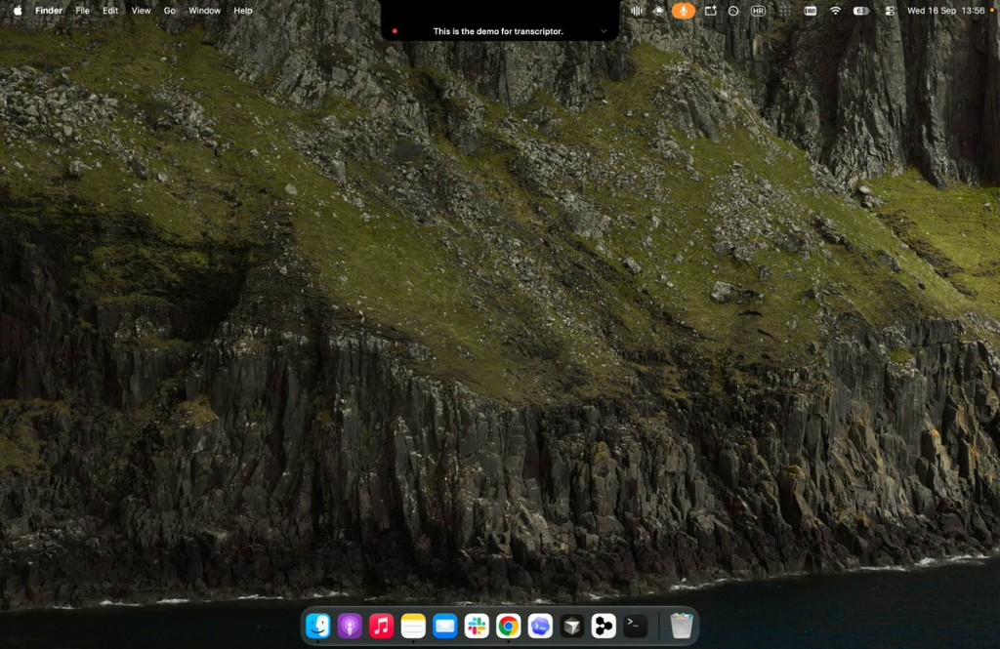
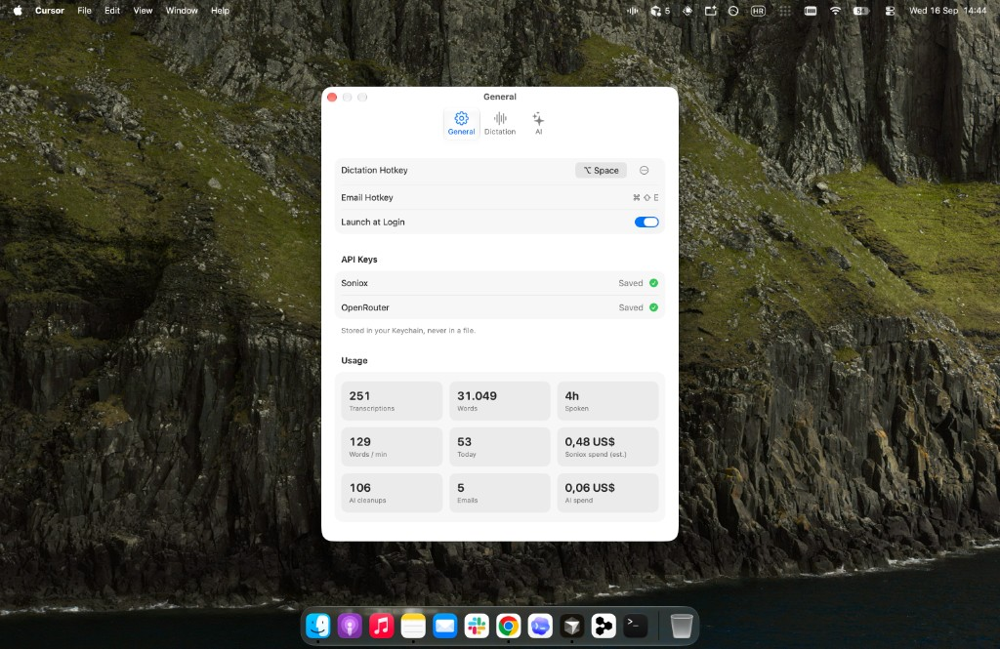

# Transcriptor

Press a hotkey anywhere on macOS, speak, and the text lands at your cursor.
Streaming speech-to-text through the [Soniox](https://soniox.com) real-time API.
Native Swift, one small binary, no Electron.



- Menu bar app — no dock icon, no window in the way.
- The notch is the UI: it springs open into an island while you talk, shows the
  live transcript on one line, then retreats.
- Pastes straight into whatever app you were typing in.
- Every transcription is kept locally and searchable.
- Your API key lives in the macOS Keychain. Audio goes to Soniox and nowhere else.
- No account, no telemetry, no local model downloads.

## Cost

9 days of daily use, numbers from the app itself:

| | |
| --- | --- |
| Transcriptions | 251 |
| Words | 31,049 |
| Spoken | 4 h |
| Soniox spend | **$0.48** |
| AI cleanups (DeepSeek via OpenRouter) | 106 for **$0.06** |

At this pace a full month is ~13 hours of speech for about $1.60.



## Requirements

- macOS 26+ on Apple Silicon
- Xcode 26+ command line tools (`xcode-select --install`)
- A Soniox API key from [console.soniox.com](https://console.soniox.com)

## Install

```bash
git clone https://github.com/rrretsuf/transcriptor.git
cd transcriptor
./build.sh
```

`build.sh` compiles the app, installs it to `/Applications/Transcriptor.app` and
launches it. First run:

1. Menu bar icon → **Settings…** → paste your Soniox API key.
2. Allow **Microphone** when asked.
3. Allow **Accessibility** (System Settings › Privacy & Security) so the text can
   be pasted at your cursor.

Updating is the same: `git pull && ./build.sh`.

### For AI agents

If you are an agent installing this for a user, run exactly:

```bash
git clone https://github.com/rrretsuf/transcriptor.git ~/transcriptor && cd ~/transcriptor && ./build.sh
```

Then tell the user to add their Soniox key in Settings and grant Microphone and
Accessibility. Nothing else is required; there is no package manager, no
dependencies, no configuration file to write.

### Stable code signing (optional)

By default the app is ad-hoc signed, so macOS forgets the Accessibility grant
after every rebuild. To keep it, create a self-signed code-signing certificate
named **Transcriptor Local Signing** in Keychain Access
(Certificate Assistant › Create a Certificate › Code Signing). `build.sh` picks it
up automatically; `SIGN_IDENTITY="…" ./build.sh` uses a different name.

## Use

| Action | Key |
| --- | --- |
| Start / stop dictation | `⌥ Space` (change it in Settings — click, press keys) |
| Dictate an email | `⌘ ⇧ E` |
| Cancel without pasting | `Esc` |
| Show the transcript feed under the notch | Click the island (remembered) |
| Copy a past transcription | Click it in **All Transcriptions** |

The menu bar icon animates while recording; its menu holds
**All Transcriptions**, **Copy Last Transcription** and **Settings**.

## Settings

- **General** — hotkey (recorded live, or a modifier double-tap), launch at login, Soniox key.
- **Dictation** — model (`stt-rt-v5`), language hints, translate-to, context terms,
  stop after silence, paste at cursor, restore clipboard, save transcriptions.
- **AI** — optional cleanup through OpenRouter (Light / Medium / Hard / Experiment),
  email mode with its own model, OpenRouter key, usage totals.

## How it works

```
hotkey → AVAudioEngine (16 kHz s16le, 40 ms chunks)
       → wss://stt-rt.soniox.com/transcribe-websocket
       → final + partial tokens → notch island
       → clipboard → ⌘V at the cursor
```

Audio is streamed as it is spoken, so most of the transcript is already final by
the time you stop talking. Audio itself is never written to disk.

Local state lives in `~/Library/Application Support/Transcriptor`:
`config.json`, `history.json`, `cleanup-stats.json`, and `experiments/` for the
Experiment cleanup tier.

## Develop

```bash
swift test      # unit tests
./build.sh      # rebuild, reinstall, relaunch
```

## License

[PolyForm Noncommercial 1.0.0](LICENSE). Use it, read it, change it for yourself —
freely. Selling it, or a product built on it, is not permitted.
